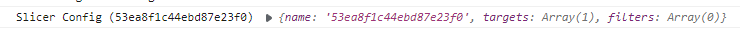
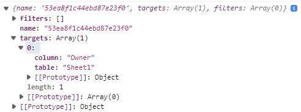
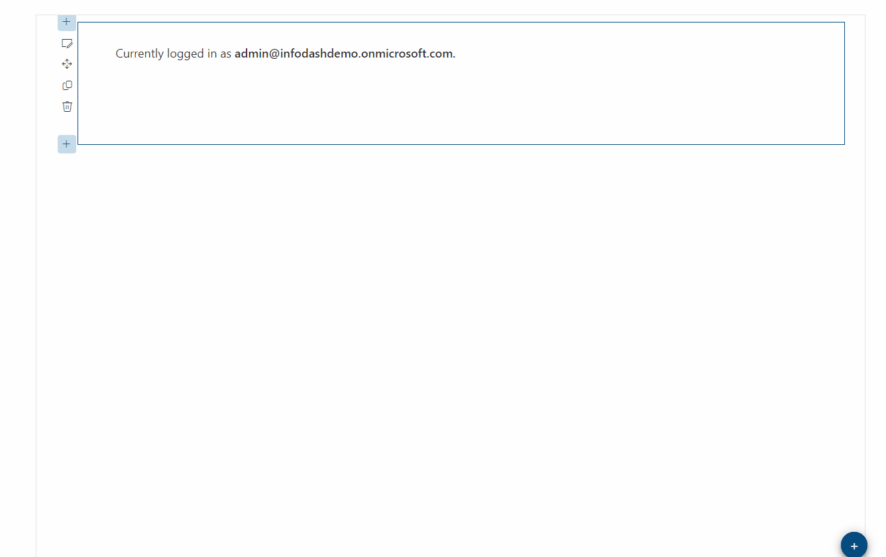

# Infodash Power BI Proof-of-Concept

## Summary

This POC was designed to use the PowerBI embed API to render PowerBI report and dynamically apply slicers on report load.

## Prerequsites

In order to SSO the logged in user to the PowerBI service and API, we need to ensure that the SharePoint App Registration (provided with each tenant) has the appropriate permissions to do so.
App Registration persmission are **delegated** permissions that are the intersection of the requested permission and the logged in user's actaul permissions. Meaning, this simply gives the
user access to do things on their behalf, but does not provide them with any additional permissions.

There are several PowerBI permissions needed to support this webpart:

| Permision | Description |
|-----------|-------------|
|Dashboard.ReadWrite.All|Read and write all dashboards|
|Dataset.ReadWrite.All|Read and write all datasets|
|Report.ReadWrite.All|Read and write all reports|
|Tenant.ReadWrite.All|Read and write all content in tenant|
|UserState.ReadWrite.All|Read and write user settings and state|
|Workspace.ReadWrite.All|Read and write user settings and state|

To grant these permissions, follow these steps:

1. Navigate to your [AAD App Registrations Page](https://portal.azure.com/#view/Microsoft_AAD_IAM/ActiveDirectoryMenuBlade/~/RegisteredApps)
2. Click **All Applications**.
3. Search for **SharePoint**.
4. Click on **SharePoint Online Client Extensibility Web Application Principal**.
5. Click on the **API Permissions** blade.
6. Click **Add a permission**.
7. Find **PowerBI Service**.
8. Choose **Delegated**.
9. After the permissions are added, you need to **Grant Admin Consent** on this page.
  - Important: The login flow is not able to prompt the user for consent so it is important that you consent as an admin.

## Solution

Solution|Author(s)
--------|---------
Infodash Power BI | Kameron Berget, kberget@getinfodash.com

## Version history

Version|Date|Comments
-------|----|--------
1.0|June 2, 2023|Initial release

## Disclaimer

**THIS CODE IS PROVIDED *AS IS* WITHOUT WARRANTY OF ANY KIND, EITHER EXPRESS OR IMPLIED, INCLUDING ANY IMPLIED WARRANTIES OF FITNESS FOR A PARTICULAR PURPOSE, MERCHANTABILITY, OR NON-INFRINGEMENT.**

---

## Minimal Path to Awesome

- Clone this repository
- Ensure that you are at the solution folder
- in the command-line run:
  - **npm install**
  - **gulp serve**
- To build and deploy, in the command-line run:
  - **gulp clean**
  - **gulp build**
  - **gulp bundle --ship**
  - **gulp package-solution --ship**
  - Upload the .sppkg file located within the SharePoint folder to your tenant's App Catalog.

## Features

This webpart illustrates the following concepts:

- Allow for single sign-on to M365 PowerBI service based on logged in user's permissions.
- Allow administrator to select Workspace and Report to render.
- Allow administrator to define target table/column in slicer to pre-filter using logged in user login. e.g. admin@company.com.
- Provide otpions to automatically hide the slicers, filters and navigation pane as needed.

### Setting up a slicer
This solution was developed to target a slicer and pre-filter the page. Slicers and filters are also known as **Targets** within the PowerBI API. As you can see
in the video below we are targeting the slicer table **Sheet1** and column **Owner** for our filter. If you do not know the target for your slicer, you can simply
render the report with no filters defined. The browser console will output a log message for each slicer on the page. The log message will inlcude the 
state of the slicer which will give you the table and column values you are looking for.

> Note: This POC can be extended to perform additional things such as rendering certain visuals, applying multiple filters, etc.

## References
- [PowerBI Client React Component](https://github.com/microsoft/powerbi-client-react)
 - [PowerBI JavaScript client](https://www.npmjs.com/package/powerbi-client)
- [Getting started with SharePoint Framework](https://docs.microsoft.com/en-us/sharepoint/dev/spfx/set-up-your-developer-tenant)